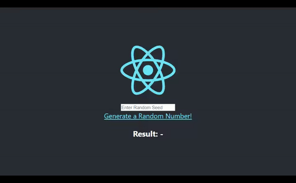
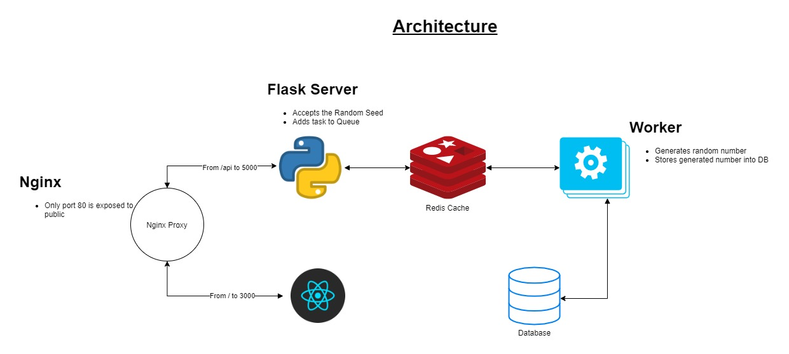

# The-Complicated-Simple-Container-App
[](https://travis-ci.org/CT83/The-Complicated-Simple-Container-App)

This is an Overly Complex Random Number Generator, created to demystify how containers work. 

## How to Run?

Easy peasy lemon squeezy. 🍋💦

1. `docker-compose up --build`

2. Visit `localhost`

>  Below is an excerpt from my Blog Post about this.

## Demo

1. User sets a Random Seed
2. Clicks Generate a Random Number
3. Random Number is generated




### Prerequisites

* You have an understanding of Docker and Docker Compose
* You have heard about Python, React and Redis

### Aim 

* To illustrate how containerization actually looks in the wild


## Architecture



1. Nginx Proxy - Exposed on port 80, Manages networking
2. React Dev Server - Accepts Input, Supports Live Reloading, Replaced with Nginx in Production
3. Flask Server - Serves the API
4. Redis Cache - To maintain the Task Queue
5. Python Worker - Uses specified Seed to Generate Random Number, stores it in DB
6. Database - PostGreSQL DB to store generated random numbers

## Working

1. React App is served, user inputs the random seed.
2. Seed is sent to the Flask API through a POST
3. Task is added to Queue
4. Worker picks up the task, generates a random number and store result in the database
5. Result is returned to the user.

## Configuration

Here, is the minified [docker-compose-prod.yml](https://github.com/CT83/The-Complicated-Simple-Container-App/blob/master/docker-compose-prod.yml)

```yaml
version: "3.3"

services:
  proxy:
    container_name: proxy
    build: 
      ...
    ports:
      - 80:80

  database:
    container_name: database
    build: database/.
    volumes:
      - ./database/db_data:/var/lib/postgresql
    ...

  client:
    container_name: client
    build: 
      ...
    environment:
      ...

  api:
    container_name: api
    build: 
    ...
    volumes:
      - ./api:/app

  worker:
    container_name: worker
    build:
    ...

  redis:
    container_name: redis
    build: 
    ...
```

You can find the development [docker-compose.yml here](https://github.com/CT83/The-Complicated-Simple-Container-App/blob/master/docker-compose.yml). It even supports Live Reloading for both, the Flask and React Container!


## Next Steps

You could now move on to trying to push the built images to DockerHub, or add TravisCI integration!

## Inspirations

[Stephen Grider](https://twitter.com/ste_grider) in his Udemy Course [Docker and Kubernetes: The Complete Guide](https://www.udemy.com/course/docker-and-kubernetes-the-complete-guide/) built an overly complex simple app, that greatly inspired me.

